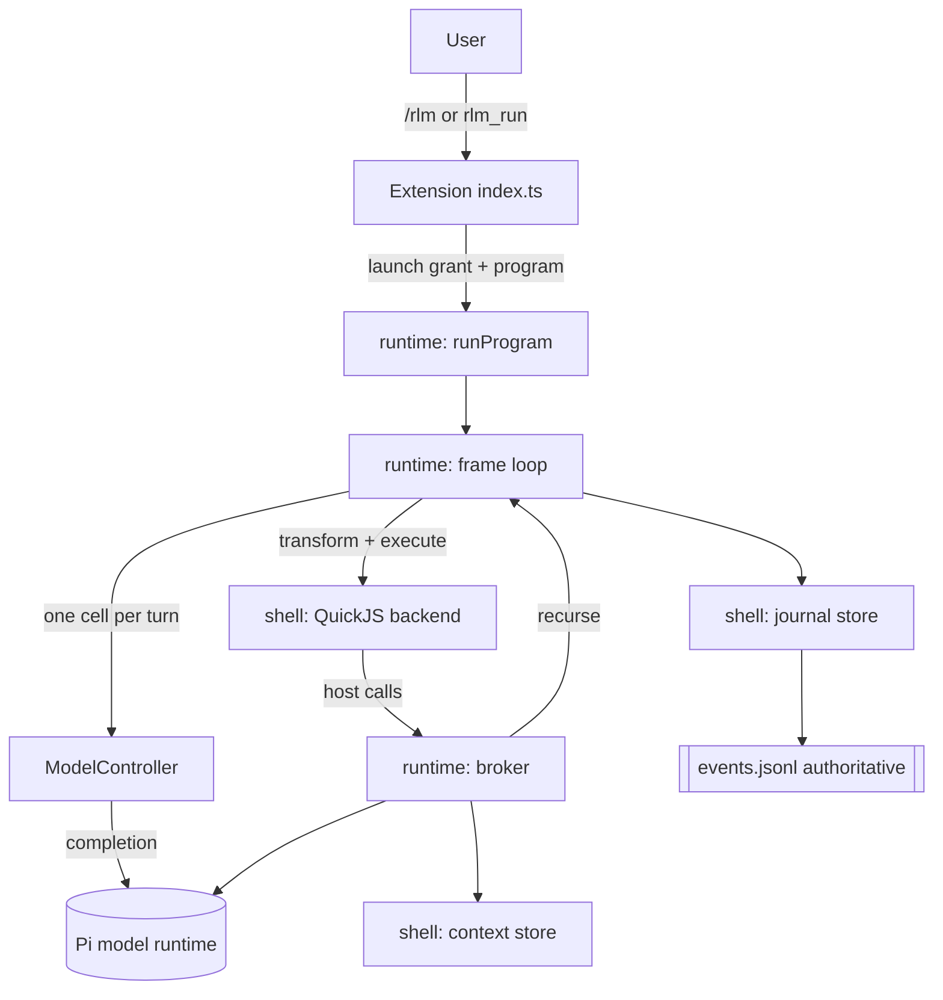

# pi-rlm architecture

pi-rlm is a functional core wrapped in an imperative shell. The core is pure,
deterministic, and heavily unit-tested. The shell performs all effects and is
kept thin so the risky parts stay small and observable.

## Layers

## Modules

Core (`src/core`, pure):

- `result.ts` typed success/failure union used everywhere.
- `json.ts` JSON model, canonical stringify, strict validation.
- `errors.ts` call, DSL, and interpreter error taxonomies.
- `preview.ts` UTF-8-safe head/tail previews with omitted-byte accounting.
- `ids.ts` content-addressed call identity from a hasher.
- `usage.ts` per-call usage accounting.
- `program.ts` `RlmProgram` normalization, reserved names, shorthand, identity.
- `workspace.ts` workspace value validation (JSON plus tagged handles).
- `cell.ts` acorn-based cell validation and last-expression transform.
- `schema.ts` minimal JSON-schema validator.
- `budget.ts` the tree-wide budget ledger reducer.
- `grant.ts` single-use launch-grant state machine.
- `trajectory.ts` immutable entries and bounded head/tail projection.
- `journal.ts` event union and the authoritative status fold.

Shell (`src/shell`, effects):

- `hash.ts`, `clock.ts` sha256 and an injectable clock.
- `context-store.ts` content-addressed snapshots with profile-bounded read, lines,
  literal grep, and chunk operations, plus derive and concat. Regex/RE2 syntax is
  deferred in v1 rather than emulated with host `RegExp`.
- `interpreter/backend.ts` the backend protocol.
- `interpreter/preamble.ts` the guest globals and DSL shims.
- `interpreter/quickjs.ts` the QuickJS backend (bun-safe async bridge).
- `journal-store.ts` append-only `events.jsonl` with fsync and torn-write
  recovery, plus a rebuildable `status.json`.
- `model/client.ts`, `model/mock.ts`, `model/pi-model.ts` the model boundary.

Runtime (`src/runtime`, coordinator):

- `profile.ts` budgets, interpreter limits, previews, and model routes.
- `state.ts` shared mutable run state.
- `call-result.ts` guest-facing result shapes.
- `semaphore.ts` leaf-concurrency bound.
- `broker.ts` the single trusted place guest calls become effects.
- `controller.ts`, `controller-prompt.ts`, `model-controller.ts` the driver.
- `mock-controller.ts` a scripted driver for tests.
- `frame.ts` the per-frame controller loop and recursion.
- `extractor.ts` the fallback-extraction contract.
- `run.ts` orchestration, input snapshotting, and completion.

## Launch authorization boundary

Launcher prompt guidance and natural-language phrases are not authority. The
extension records the public Pi 0.80.10 `input` and `turn_start` events in
host-owned closure state, uses `sessionManager.getSessionId()` for the real
session identity, and derives the turn binding from Pi's `turnIndex` and
`timestamp`. The originating input correlation survives provider continuation
turns after other tools; a new input, successful consumption, agent end, expiry,
or session shutdown clears it. `rlm_run` always requires dialog-capable UI and
confirmation of the canonical normalized request. Headless tool calls fail
closed regardless of prompt content.

When `rlm_run.execute` starts, it atomically reserves the surviving correlation
for that exact tool-call ID and request hash. After confirmation, a grant binds
the session, current continuation turn, originating-input hash, request hash,
and tool call. It expires and is synchronously removed before runtime or
backend initialization. Consumed metadata is persisted as a
`pi-rlm-launch-grant` custom entry without source contents.

Pi 0.80.10 does not expose an opaque turn nonce or the current user entry from a
tool's `execute` context. Therefore `turnIndex:timestamp` is the strictest
public host turn identity available, correlated through lifecycle events; it is
not described as a Pi-issued nonce. Missing correlation fails closed. `/rlm`
bypasses the agent turn lifecycle, so the command handler creates a unique
host-owned command nonce and immediately consumes its bound grant.

## Invariants

- Full source content never enters a model request unless a bounded slice was
  selected explicitly.
- One controller response yields at most one committed cell.
- Budget errors are catchable `CallResult` values; spec errors throw inside the
  guest; interpreter faults fail the cell and cannot be caught.
- The event journal is the source of truth; status is a pure fold of events.
- Content-addressed identity makes duplicate calls cache and makes replay
  idempotent.

## Stored-byte accounting scope

`storedByteLimit` bounds logical payload bytes retained for a run. The tree-wide
ledger reserves the exact unique delta before mutation, then commits or rolls
back with the mutation. Included producers:

- UTF-8 context payloads: initial source batches, derive, concat, chunks,
  artifact-to-context conversion, and direct/fallback answer snapshots. A SHA
  already present in `ContextStore` has zero delta, including duplicate chunks.
- UTF-8 artifact payloads retained by artifact id. Duplicate content in the
  artifact map has zero delta; a separate context snapshot is a separate
  logical producer.
- Canonical JSON bytes for each distinct `GuestCallResult` retained in the call
  cache. In-flight provider values are transient and become chargeable only if
  cache insertion commits.

The logical payload is charged once even when `ContextStore` keeps both an
in-memory byte array and its durable content-addressed file. Returned views,
bounded previews, workspace/trajectory objects, and serialization buffers are
transient and not additional charges. `events.jsonl`, rebuildable `status.json`,
run-manifest hashes, and control metadata are excluded: this journal is the
authoritative control plane and must remain writable to record exhaustion and
terminal state. The v1 checkpoint bridge stores no snapshots. Provider-token
accounting remains separate from stored bytes.

## Model invocation accounting

`src/runtime/provider.ts` is the only production location that calls
`ModelClient.complete`. It validates the complete request, estimates all system,
prompt, context, canonical structured-schema, and enforced-output tokens, then
atomically reserves the logical operation (on its first attempt), attempt, tokens, and concurrency slot
before entering the provider. Every exit settles finite reported tokens, cost,
and duration; `finally` releases token and concurrency reservations. Reported
token overshoot remains charged and blocks later reservations.

| Path | Logical operations | Attempts | Usage ownership |
| --- | ---: | ---: | --- |
| Controller turn, valid primary | 1 | 1 | controller trajectory, `provider_attempted`, tree ledger |
| Controller malformed primary + repair | 1 | 2 | combined on the same turn operation |
| Leaf `llm`, valid primary | 1 | 1 | `CallResult`, `call_committed`, tree ledger |
| Leaf structured repair | 1 | 2 | combined on the same leaf operation |
| Provider fallback extractor | 1 | provider completions | extractor provider events and tree ledger |
| External custom extractor | 1 | 1 explicit opaque operation | zero reported tokens/cost, measured host duration; no nested completion capability |
| `recurse` | 1 frame operation | 0 itself | parent-lineage-scoped identity; subtree provider usage copied into its result, never re-settled |
| Child-frame controller/leaf | their own operations | each provider completion | tree ledger once; propagated to ancestor recurse scopes |
| Successful cache/coalesced waiter | 0 additional | 0 additional | cached committed result; failed recurse results remain retryable |

Controller turns and provider attempts are independent limits. A controller
turn is not entered when no attempt remains. `maxAttempts: 0` therefore invokes
neither the controller nor a provider. A repair reserves its second attempt
before spend.

Extractor implementations declare `accountingMode`. `provider` extractors must
use the supplied completion capability and fail if they return without doing
so. `external` extractors receive no completion capability while holding their
leaf slot; because arbitrary external code cannot report internal provider
accounting, the runtime charges one explicit logical operation and attempt.
Settlement and scoped aggregation happen once before journal persistence, so a
typed journal failure cannot charge the opaque operation twice. This is an
opaque-operation contract, not a claim about hidden transport token usage.

Recurse call identity and key binding include the deterministic parent controller
lineage. Equal calls under one parent coalesce, while equal keys in separate
parent frames have independent results and cancellation. Only successful child
results enter `callCache`; failed attempts are journaled but may retry against
the durable key binding.

Pi 0.80.10's public `ModelRuntime.completeSimple` options support `maxRetries`.
`PiModelClient` sets it to `0`, verified with an adapter fake, so one boundary
attempt maps to one Pi transport request. Provider-side processing or replay
below the SDK boundary remains unobservable; the ledger reports only usage Pi
returns and never invents transport attempts.
