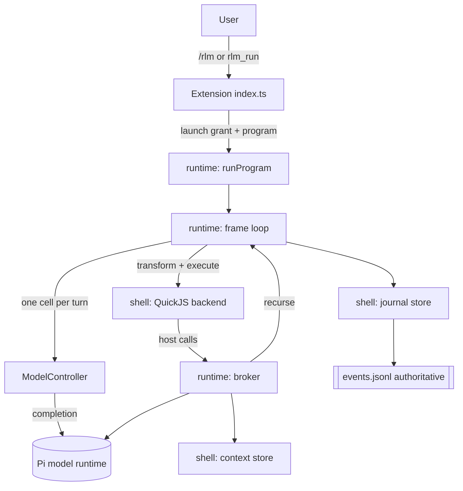

# pi-rlm architecture

pi-rlm is a functional core wrapped in an imperative shell. The core is pure,
deterministic, and heavily unit-tested. The shell performs all effects and is
kept thin so the risky parts stay small and observable.

## Layers

## Modules

Core (`src/core`, pure):

- `result.ts` typed success/failure union used everywhere.
- `json.ts` JSON model, canonical stringify, strict validation.
- `errors.ts` call, DSL, and interpreter error taxonomies.
- `preview.ts` UTF-8-safe head/tail previews with omitted-byte accounting.
- `ids.ts` content-addressed call identity from a hasher.
- `usage.ts` per-call usage accounting.
- `program.ts` `RlmProgram` normalization, reserved names, shorthand, identity.
- `workspace.ts` workspace value validation (JSON plus tagged handles).
- `cell.ts` acorn-based cell validation and last-expression transform.
- `schema.ts` minimal JSON-schema validator.
- `budget.ts` the tree-wide budget ledger reducer.
- `grant.ts` single-use launch-grant state machine.
- `trajectory.ts` immutable entries and bounded head/tail projection.
- `journal.ts` event union and the authoritative status fold.

Shell (`src/shell`, effects):

- `hash.ts`, `clock.ts` sha256 and an injectable clock.
- `context-store.ts` content-addressed snapshots with read, lines, grep, chunk,
  derive, and concat.
- `interpreter/backend.ts` the backend protocol.
- `interpreter/preamble.ts` the guest globals and DSL shims.
- `interpreter/quickjs.ts` the QuickJS backend (bun-safe async bridge).
- `journal-store.ts` append-only `events.jsonl` with fsync and torn-write
  recovery, plus a rebuildable `status.json`.
- `model/client.ts`, `model/mock.ts`, `model/pi-model.ts` the model boundary.

Runtime (`src/runtime`, coordinator):

- `profile.ts` budgets, interpreter limits, previews, and model routes.
- `state.ts` shared mutable run state.
- `call-result.ts` guest-facing result shapes.
- `semaphore.ts` leaf-concurrency bound.
- `broker.ts` the single trusted place guest calls become effects.
- `controller.ts`, `controller-prompt.ts`, `model-controller.ts` the driver.
- `mock-controller.ts` a scripted driver for tests.
- `frame.ts` the per-frame controller loop and recursion.
- `extractor.ts` the fallback-extraction contract.
- `run.ts` orchestration, input snapshotting, and completion.

## Launch authorization boundary

Launcher prompt guidance is not authority. The extension records the public Pi
0.80.10 `input` and `turn_start` events in host-owned closure state, uses
`sessionManager.getSessionId()` for the real session identity, and derives the
turn binding from Pi's `turnIndex` and `timestamp`. It hashes the exact user
input and the canonical normalized launch request. A grant also binds the exact
Pi tool-call ID, expires, and is synchronously removed before runtime or backend
initialization. Consumed grant metadata is persisted as a `pi-rlm-launch-grant`
custom entry without source contents.

Pi 0.80.10 does not expose an opaque turn nonce or the current user entry from a
tool's `execute` context. Therefore `turnIndex:timestamp` is the strictest
public host turn identity available, correlated through lifecycle events; it is
not described as a Pi-issued nonce. Missing correlation fails closed. `/rlm`
bypasses the agent turn lifecycle, so the command handler creates a unique
host-owned command nonce and immediately consumes its bound grant.

## Invariants

- Full source content never enters a model request unless a bounded slice was
  selected explicitly.
- One controller response yields at most one committed cell.
- Budget errors are catchable `CallResult` values; spec errors throw inside the
  guest; interpreter faults fail the cell and cannot be caught.
- The event journal is the source of truth; status is a pure fold of events.
- Content-addressed identity makes duplicate calls cache and makes replay
  idempotent.
