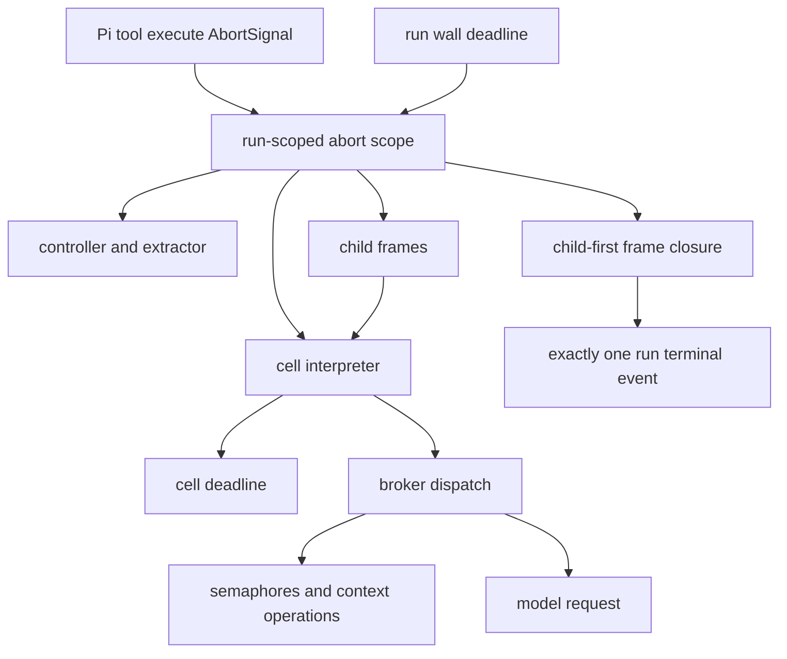

# Cancellation ownership

`rlm_run` uses Pi's tool `execute` signal as the sole owner signal. Cancellation while confirmation is pending returns before minting or consuming a launch grant. Once consumed, the grant remains spent even if the run is then cancelled.

The `/rlm` command API in Pi 0.80.10 does not provide a command-scoped `AbortSignal`. The extension therefore owns an `AbortController` for each command run and aborts it on Pi session switch, fork, restart, or shutdown lifecycle events. Pi currently exposes no command-handler API for mapping an interactive Escape press to that controller; no unsupported cancellation hook is invented here.

The journal is deliberately not cancelled. Already-started effects drain, open frames close child-first, and the first `run_completed`, `run_failed`, or `run_cancelled` event becomes authoritative. Later queued callbacks are ignored by the journal store and cannot change terminal status.
