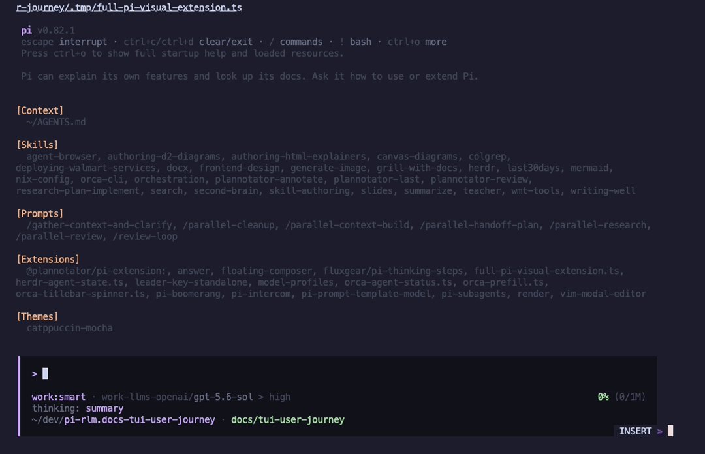
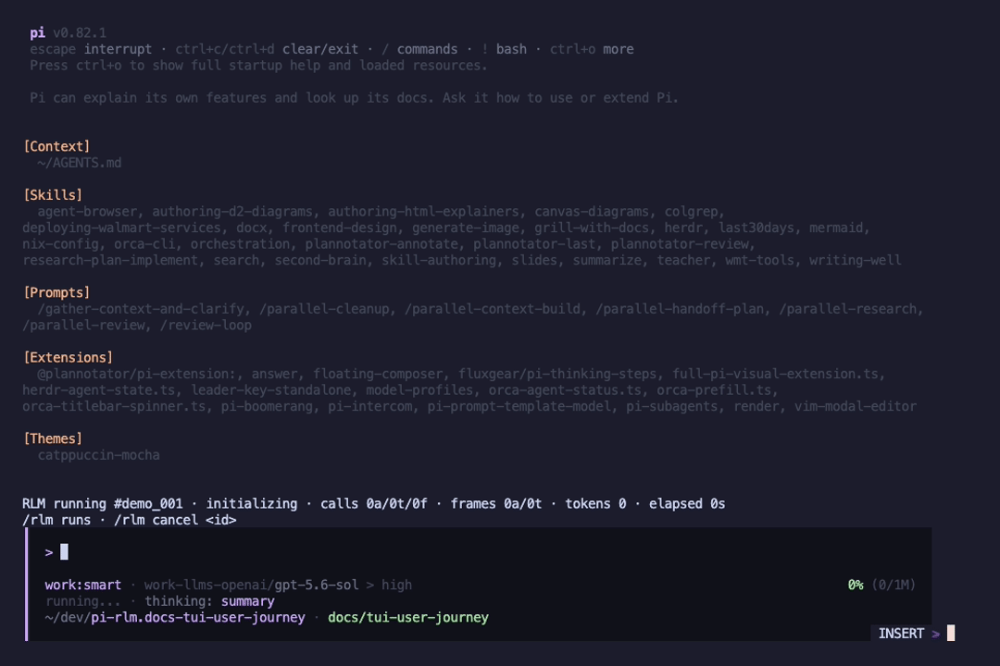
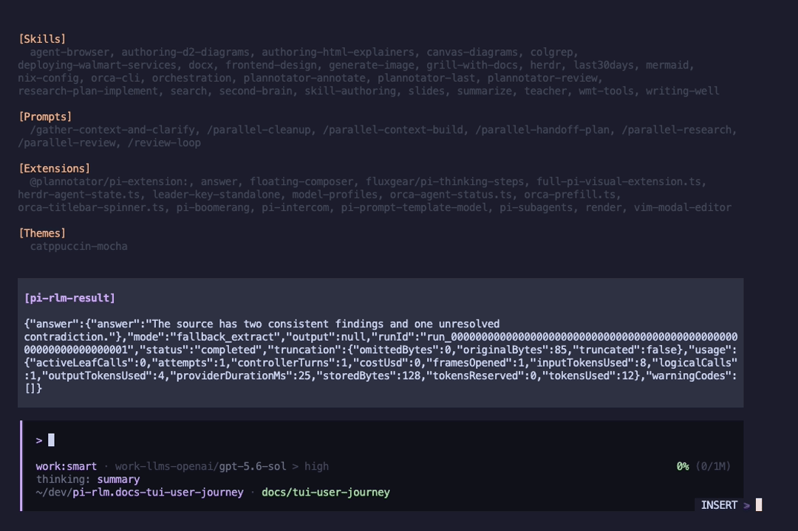
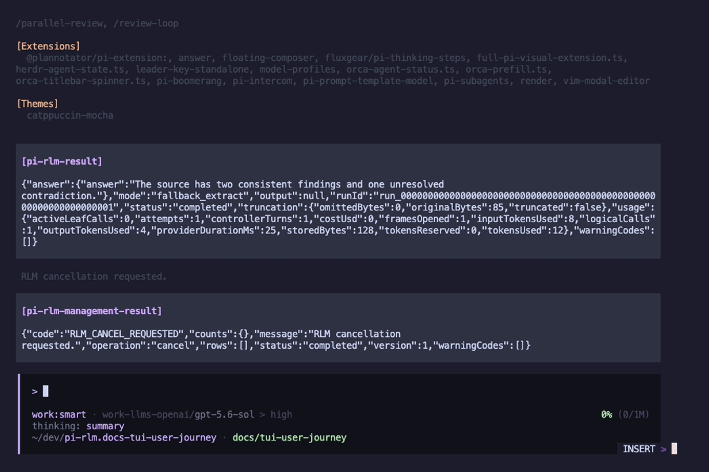
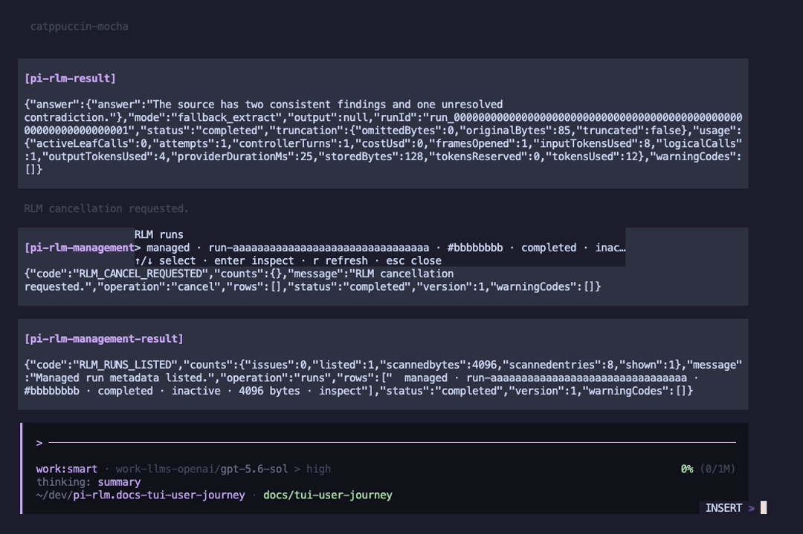
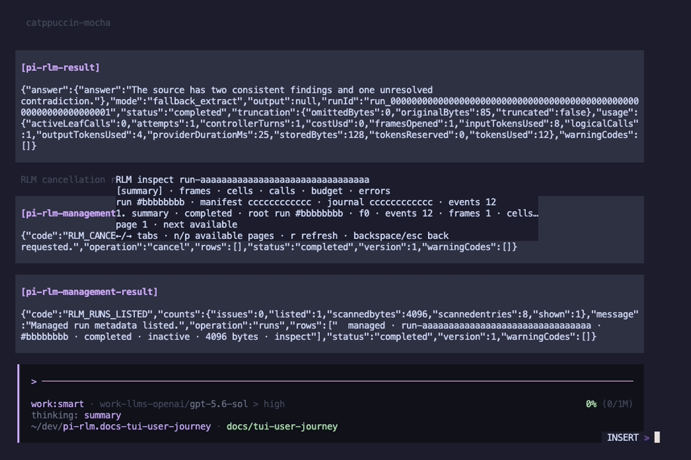
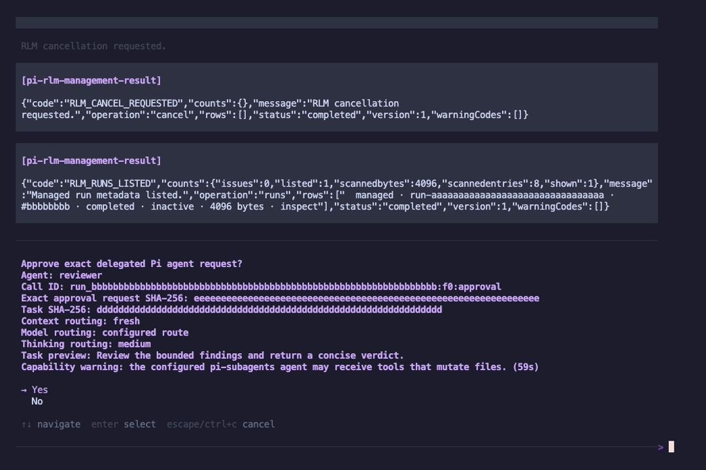

# TUI user journey

These screenshots show pi-rlm inside a full Pi CLI session. Pi loaded the user's normal context file, skills, prompts, extensions, model profile, and `catppuccin-mocha` theme.

The screenshots use the production pi-rlm commands, widgets, result renderer, navigator, inspector, and approval dialog. A deterministic local execution fixture supplied the demo results so the capture made no provider request and needed no credential. The capture ran on Pi 0.82.1. Version 0.1.0 release acceptance remains pinned to Pi 0.80.10.

## 1. Start from the normal Pi environment

Pi keeps the existing setup. pi-rlm loads alongside the other extensions rather than replacing the session UI.

## 2. Start an explicit run

The user enters an exact `/rlm` source form. The widget shows the local run alias, phase, calls, frames, token use, and elapsed time. It also keeps the run and cancel commands visible.

## 3. Receive a bounded result

The completed run appears as a visible `pi-rlm-result`. The result includes the answer, completion mode, terminal status, truncation data, and bounded accounting.

## 4. Cancel a detached run

A detached run gets a local alias. `/rlm cancel <alias>` requests cancellation through the process-local capability and returns a typed management result.

## 5. Browse retained runs

`/rlm runs` opens the navigator. The user can select a retained run, refresh the list, or open inspection without exposing source text or filesystem paths.

## 6. Inspect trusted metadata

The inspector has summary, frames, cells, calls, budget, and errors views. Each view supports bounded cursor pages. The screenshot shows the summary tab.

## 7. Approve one exact delegated agent request

Agent delegation pauses at a host-owned confirmation. The dialog shows the agent, call identity, request and task hashes, routing, task preview, and capability warning. Approval applies only to that exact request.

## Capture boundary

The screenshots are terminal frames captured from Pi's real `InteractiveMode` in Herdr, then rendered from the ANSI viewport without changing the TUI content. The local fixture makes the sequence reproducible, but it does not prove provider output quality. Provider behavior is covered separately by the release-bound live acceptance report.
