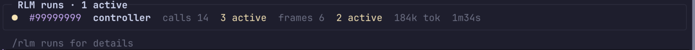
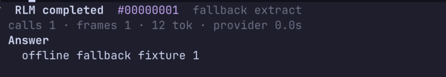
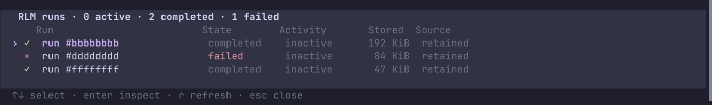
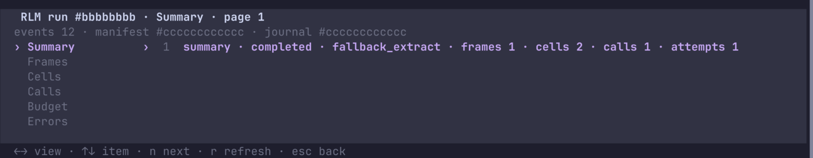
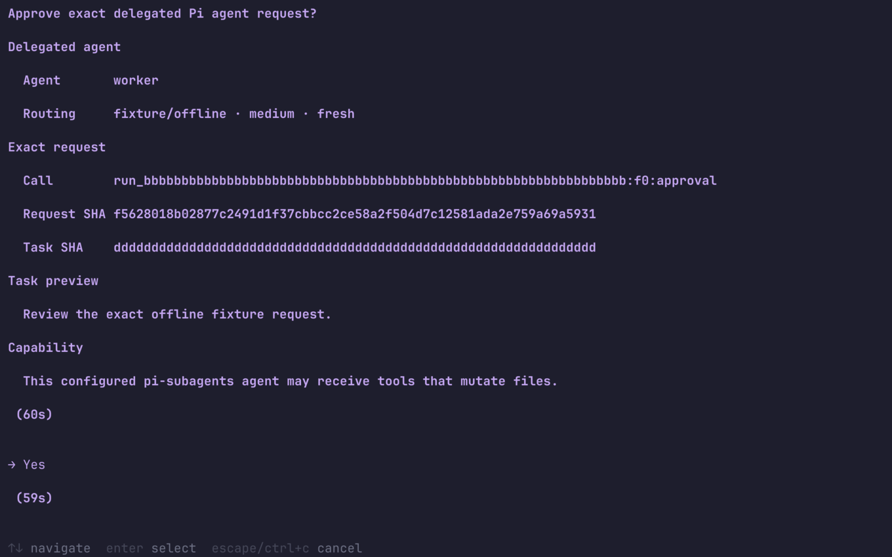

# How to use pi-rlm in Pi

pi-rlm lets you start a bounded recursive model run, watch its progress, read its answer, inspect retained metadata, and approve delegated Pi agents. This guide follows that journey in the terminal interface.

The terminal interface is available only in Pi's interactive mode. RPC, print, and JSON modes return bounded text and metadata instead of interactive views.

## Before you start

This guide documents the workflow interface on commit `711d68a1a8a2a9f288715d72bd9aac0327eecbf9` and later commits on `main`. The protected `v0.1.0` tag predates this interface and keeps the earlier TUI.

Pi 0.80.10 and Bun 1.3.14 or a later Bun 1.x release are required. Install the exact reviewed interface commit, then start Pi.

```bash
pi install git:github.com/adityavkk/pi-rlm@711d68a1a8a2a9f288715d72bd9aac0327eecbf9
pi
```

Use the moving `main` branch only when you intend to take later changes.

```bash
pi install git:github.com/adityavkk/pi-rlm
```

If a run will delegate work to another Pi agent, install the separate public bridge.

```bash
pi install npm:pi-subagents@0.36.0
```

The bridge enables delegation transport. It does not approve an agent or grant tools by itself.

## The user journey

| Step | What you do | What pi-rlm does |
|---|---|---|
| 1 | Start a run with `/rlm` | Creates one authorized run from the source you supplied. |
| 2 | Read the active tray | Shows the current phase and bounded accounting. |
| 3 | Read the result | Shows terminal status, accounting, and the bounded answer or error. |
| 4 | Open `/rlm runs` | Lists current process activity and retained runs. |
| 5 | Inspect a retained run | Shows bounded lifecycle and accounting metadata by category. |
| 6 | Approve an agent request | Grants or denies one exact delegated request. |
| 7 | Resume or clean up | Continues an eligible checkpoint or removes eligible retained runs. |

## 1. Start a run

Use `/rlm` when you want to start a run yourself. pi-rlm never turns an ordinary Pi prompt into a run on its own.

The shortest form provides an objective and inline context.

```text
/rlm {"objective":"Summarize the contradictions","context":"Paste the source material here."}
```

Choose the source form that matches your work.

| Source | Command | Use it when |
|---|---|---|
| Inline text | `/rlm {"objective":"...","context":"..."}` | The source is short enough to paste into the command. |
| Typed program with no inputs | `/rlm {"program":{"objective":"...","inputs":[],"outputs":[{"name":"answer","schema":{"type":"string"}}],"profile":"default"}}` | You need an explicit output schema and the program declares no inputs. |
| File | `/rlm --file "relative/path.md" -- Summarize the contradictions` | The source already exists in a file. |
| Current conversation | `/rlm --session -- Summarize the active conversation branch` | The active Pi conversation is the source. |

A typed program with inputs supplies one source for every declared input.

```text
/rlm {"program":{"objective":"Summarize the source","profile":"default","inputs":[{"name":"source","adapter":"text","description":"Material to summarize"}],"outputs":[{"name":"answer","schema":{"type":"string"}}]},"sources":{"source":"Paste the source material here."}}
```

A typed program may omit `sources` only when it declares zero inputs. Every declared input otherwise needs a present string with non-whitespace content. The command must match one of these forms. Bare objectives, trailing arguments, malformed JSON, and missing sources fail before model work starts.

A model can also request the `rlm_run` tool. Interactive Pi asks you to approve the normalized objective, source identity, and exact request hash before the tool can spend any budget. Prompt text such as "use pi-rlm" never counts as approval.

## 2. Read the active run tray

The tray stays above the editor while a local run is active. You can keep using the Pi session while a detached run continues.



At sufficient width, a normal running row shows the fields in the table. The tray shows at most three rows. Its title reports how many additional runs are hidden.

| Field | Meaning |
|---|---|
| `●` | The run is active. Color is secondary to this marker. |
| `◐` | The run is cancelling. |
| `!` | The run is waiting for delegated agent approval. An approval row shows the agent name and pending count instead of progress metrics. |
| `#99999999` | A short display identity for the run. It is not a path or an authorization token. |
| `controller` | The current phase. pi-rlm shows one current phase and does not invent a future plan. |
| `calls 14` | The number of logical calls admitted so far. |
| `3 active` | The logical calls that are active now. |
| `frames 6` | The total root and child frames opened so far. |
| `2 active` | The frames that are active now. |
| `184k tok` | The bounded token accounting reported for the run. |
| `1m34s` | Elapsed time for the current local run. |

The tray removes metrics as terminal width shrinks. A narrow row keeps the status, identity, current phase, and elapsed time. Below 60 columns, the tray becomes one compact line with active, approval, and cancelling counts.

The tray does not show prompts, source text, provider responses, paths, or raw errors.

### Stop a local run

Press `Ctrl+C` to interrupt a foreground run when Pi forwards the run's abort signal.

For a detached run, use the exact local alias from the notification that started it.

```text
/rlm cancel <current local alias>
```

Cancellation works only for a run owned by the current Pi process. pi-rlm refuses to target a run in another process or a retained run that no longer has a local cancellation capability.

## 3. Read the completed result

The final conversation entry keeps the answer visible without printing the raw result object.



The first line gives the terminal state, short run identity, and completion mode. The accounting line always gives calls, frames, and tokens. Nonzero cost and provider duration are appended. The `Answer` or `Error` section contains bounded human readable content.

Terminal markers have fixed meanings.

| Marker | State | Meaning |
|---|---|---|
| `✓` | Completed | pi-rlm committed an answer. |
| `×` | Failed | pi-rlm stopped with a typed failure. |
| `-` | Cancelled | The run stopped after cancellation. |

Pi shows up to six wrapped answer or error lines in the collapsed view. Press `Ctrl+O`, Pi's normal output expansion key, to show up to 40 lines from the content already delivered to Pi. Expansion does not fetch omitted content. If the complete answer exceeds the 64 KiB delivery limit, pi-rlm shows a deterministic head and tail preview and marks the result as truncated. The content addressed output descriptor remains authoritative.

## 4. Find current and retained runs

Open the navigator.

```text
/rlm runs
```



Each row separates selection from status.

| Column or marker | Meaning |
|---|---|
| `›` | The selected row. This marker moves when you press Up or Down. |
| `✓`, `×`, `●`, `◐`, `-`, or `·` | Completed, failed, active, cancelling, cancelled, or inactive state. |
| `Run` | A bounded display identity. The view does not expose a filesystem path. |
| `State` | The run lifecycle state. |
| `Activity` | Whether a current writer or local owner is active. |
| `Stored` | The bounded stored byte count. |
| `Source` | `session` for current process activity or `retained` for managed storage. |

Use these keys in the navigator.

| Key | Action |
|---|---|
| Up or Down | Move the selection. |
| Enter | Inspect the selected retained run. |
| `r` | Refresh the list from a new bounded snapshot and reset selection to the first row. |
| Escape or `Ctrl+C` | Close the navigator. |

`Ctrl+C` inside the navigator closes the view. It does not cancel a run. Use `/rlm cancel <current local alias>` for cancellation.

Selection does not grant cancellation, resume, or deletion authority. It only chooses a row for inspection.

## 5. Inspect a retained run

Press Enter on a retained row in the navigator. If you already have an exact managed name, you can open it directly.

```text
/rlm inspect run-<32 lowercase hex>
```



The left rail chooses the metadata category. The right pane shows one bounded page from an authenticated journal prefix.

| View | What it shows |
|---|---|
| Summary | Terminal state, completion mode, frame and cell counts, committed journal calls, and observed provider attempts. |
| Frames | Frame identity, parent, depth, state, cell count, and committed journal call count. |
| Cells | Frame and iteration identity, code hash, result state, byte counts, and reported usage. It does not show cell code or output text. |
| Calls | Call kind, bounded identity, execution count, outcome, reported usage, output hash, and byte count. It does not show prompts or responses. |
| Budget | Configured limits and journal derived lower bounds. Token and cost values are reported usage, duration is provider duration, and content is committed content bytes. |
| Errors | Trusted codes plus hashes and byte counts for error fields. It does not show provider or exception text. |

Use these keys in the inspector.

| Key | Action |
|---|---|
| Left, Right, Tab, or Shift+Tab | Change the metadata view. |
| Up or Down | Move within the current page. |
| `n` or Page Down | Request the next authenticated backend page. |
| `p` or Page Up | Return to a previous authenticated page. |
| `r` | Refresh the current view. |
| Escape, Backspace, or `Ctrl+C` | Close the inspector. |

If you opened the inspector from `/rlm runs`, closing it returns to the navigator. Escape or `Ctrl+C` then closes the navigator. If you used direct `/rlm inspect`, closing the inspector returns to the Pi session. `Ctrl+C` inside either view does not cancel a run.

Inspection is intentionally metadata only. `committedCalls` is not the logical call ledger for the full run tree. The reported token, cost, duration, and content values are lower bounds derived from the journal. Exact recovered accounting requires checkpoint recovery. Use the completed conversation result to read the delivered answer.

## 6. Approve a delegated Pi agent

A run pauses when it asks to use a Pi agent that is not already allowlisted. Pi owns the confirmation dialog.



Review each section before accepting.

| Field | What to check |
|---|---|
| Agent | The configured Pi agent name. |
| Routing | The model, thinking level, and context mode. Standard pi-rlm delegation uses fresh context unless the host explicitly enables another mode. |
| Call | The exact call identity inside this run. |
| Request SHA | The hash that binds the full approval request. |
| Task SHA | The hash that binds the authoritative task. |
| Task preview | A bounded display preview. The task hash, not the preview, binds the task. |
| Capability | A warning that the configured agent may receive tools that can change files. |

Press `y` or Enter on `Yes` to approve the exact request. Press `n`, Escape, or `Ctrl+C` to deny it. A timeout or abort also denies it. Approval is single use and cannot authorize a later request.

You can allow configured names without a dialog.

```bash
export PI_RLM_AGENT_ALLOWLIST="reviewer,worker"
```

The allowlist trusts the full configured capability set of each named agent. Use it only for agents you would approve every time.

## 7. Resume or clean up retained runs

### Resume an eligible checkpoint

Resume accepts an exact managed name only.

```text
/rlm resume run-<32 lowercase hex>
```

Interactive Pi asks you to approve the exact run, manifest, checkpoint, writer generation, and current session before continuation. pi-rlm consumes that approval before it opens factories, repairs state, hydrates a checkpoint, or starts external work.

A completed, failed, or cancelled run is terminal and cannot resume. A run also remains inspect only when its checkpoint is missing, incompatible, ambiguous, or expired. Resume keeps the original deadline instead of starting a new one.

The compact TUI row does not expose or copy the full managed name. Use the resume command only when a prior host result or integration gives you the exact `run-...` name. Do not reconstruct it from a short `#hash` label.

### Clean up retained runs

Start with a dry run.

```text
/rlm cleanup --dry-run
```

The dry run reports what current policy would select, but it does not reserve deletion authority. The result can change before a later apply.

Apply normal age, count, and byte retention policy with:

```text
/rlm cleanup
```

Normal cleanup can also remove a nonterminal run that is proven abandoned for at least 90 days.

Include every safely inactive terminal run regardless of age, count, or byte selection with:

```text
/rlm cleanup --force
```

Force does not bypass the 90 day abandoned nonterminal grace or any live, ambiguous, or malformed safety check. Apply and force write a bounded host audit before deletion. Retention uses normal filesystem deletion and does not provide secure erasure.

## Command reference

| Command or tool | What it does |
|---|---|
| `/rlm <source form>` | Starts one host initiated run. |
| `rlm_run` | Lets the model request a run, subject to exact host approval in interactive Pi. |
| `/rlm runs` | Opens the interactive navigator and returns a bounded listing result. |
| `/rlm inspect <managed name>` | Opens bounded metadata for one exact retained run. |
| `/rlm resume <managed name>` | Continues one eligible checkpoint after exact authorization. |
| `/rlm cancel <local alias>` | Cancels one active run owned by the current process. |
| `/rlm cleanup --dry-run` | Reports the current cleanup selection without deleting. |
| `/rlm cleanup` | Applies normal retention policy. |
| `/rlm cleanup --force` | Includes every safely inactive terminal run in cleanup selection. |

## Limits to remember

- The interactive navigator and inspector exist only in TUI mode.
- The active tray shows accounting, not the model's private reasoning or a planned phase list.
- Result and inspection views enforce byte, line, row, and page limits.
- Inspection does not reveal answer text, prompts, responses, paths, or raw errors.
- Cancellation authority stays in the process that owns the active run.
- Resume requires the exact managed name and a valid nonterminal checkpoint.
- Cleanup is ordinary filesystem deletion, not secure erasure.
- QuickJS and tool filtering limit capabilities, but they are not an operating system sandbox. Do not run untrusted code against secrets.

## Screenshot boundary

The screenshots are cropped native terminal captures from a full Pi session running in Ghostty through Herdr. Pi used its normal context, skills, prompts, extensions, model profile, and `catppuccin-mocha` theme. Pi also loaded the committed [`full-pi-visual-extension.ts`](../src/extension/testing/full-pi-visual-extension.ts) fixture for deterministic run data. The fixture makes no provider request and needs no credential.

Cropping removes the Herdr sidebar, prior conversation rows, and empty terminal space. Displayed pi-rlm content is unchanged. Accounting values are synthetic fixture data. The screenshots prove the interaction and rendering path, not provider output quality. See [live provider acceptance](live-provider-acceptance.md) for provider behavior evidence.
